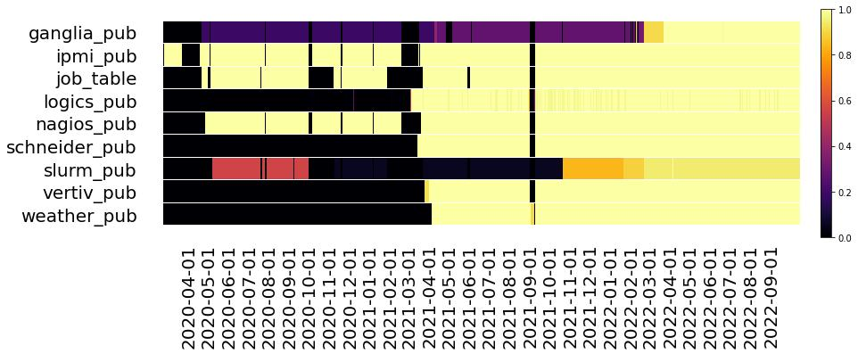
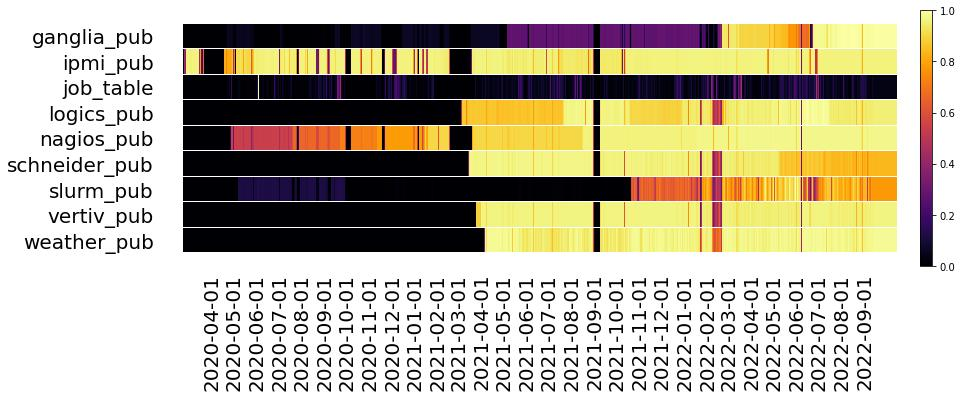

# Spatial distribution of racks
 [Racks](racks_spatial_distribution.md)
# Plugins
Each plugin is described, including metadata about its metrics and its specific columns.

Plugins:
- [Ganglia](plugins/ganglia.md)
- [IPMI](plugins/ipmi.md)
- [Job table](plugins/job_table.md)
- [Logics](plugins/logics.md)
- [Nagios](plugins/nagios.md)
- [SLURM](plugins/slurm.md)
- [Schneider](plugins/schneider.md)
- [Vertiv](plugins/vertiv.md)
- [Weather](plugins/weather.md)

## Metrics/day (per plugin)
Yellow indicates the maximum (relative to the plugin), black the minimum.

## Samples/day (per plugin)
Yellow indicates the maximum (relative to the plugin), black the minimum.
